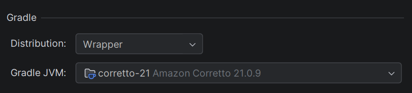
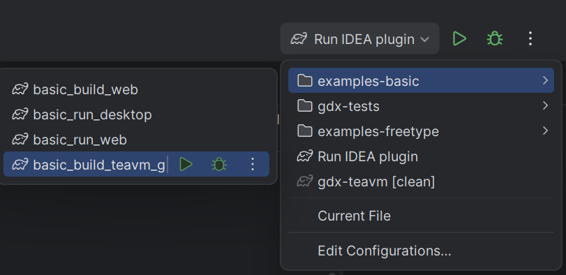
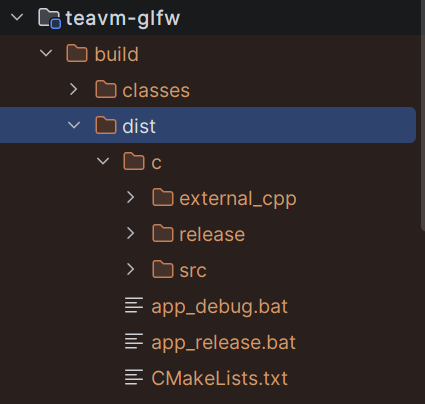

# TeaVM-GLFW Build Instructions

This guide explains how to compile Java code to C using TeaVM and build a native executable with CMake.

## Prerequisites

Before you begin, ensure you have the following installed:

- **Java 21** (or compatible version)
  - Set the correct Java version in Project Settings -> Gradle JVM
  
  
- **Visual Studio Community 2022** (or later) with C++ development tools
  - Older versions may work but have not been tested
  
- **CMake** (required for building the C code)

## Step 1: Generate C Code from Java

Run the Gradle task to generate C code using TeaVM:

**Option A: Using Gradle Command**
```
gradlew :examples:basic:teavm-glfw:basic_build_teavm_glfw
```

**Option B: Using IntelliJ Run Configuration**



### Output

By default, the generated files are placed in ```build/dist``` and should look like this:



**Note:** You can customize the output destination in ```BuildTeaVMTestDemo``` by calling ```build(new File("your/custom/path"))```

## Step 2: Compile C Code to Native Executable

You have two options for compiling the generated C code:

### Option A: Using Automated Scripts (Recommended)

Two batch files are automatically generated to simplify the build process:
- ```app_debug.bat``` - Builds a debug executable
- ```app_release.bat``` - Builds an optimized release executable

Simply double-click either script. It will:
1. Run CMake to configure the project
2. Detect your Visual Studio installation
3. Compile the C code into an executable

### Option B: Manual Build with CMake

1. Open a terminal in the ```build/dist``` folder
2. Run CMake to generate build files:
   ```
   cmake .
   ```
3. Open the generated Visual Studio solution file
4. Build the project in Visual Studio

### Linux

Just type

```shell
cmake .
make
```

or to build debug version, following:

```shell
cmake -DCMAKE_BUILD_TYPE=Debug
make
```

## Output

After successful compilation, you will find:
- The executable in ```build/dist/c/release/```
- The assets folder in the same directory

## Customization

The batch scripts and CMakeLists.txt files are generated by the ```TeaGLFWBackend``` class. You can modify this class to customize the build configuration as needed.
