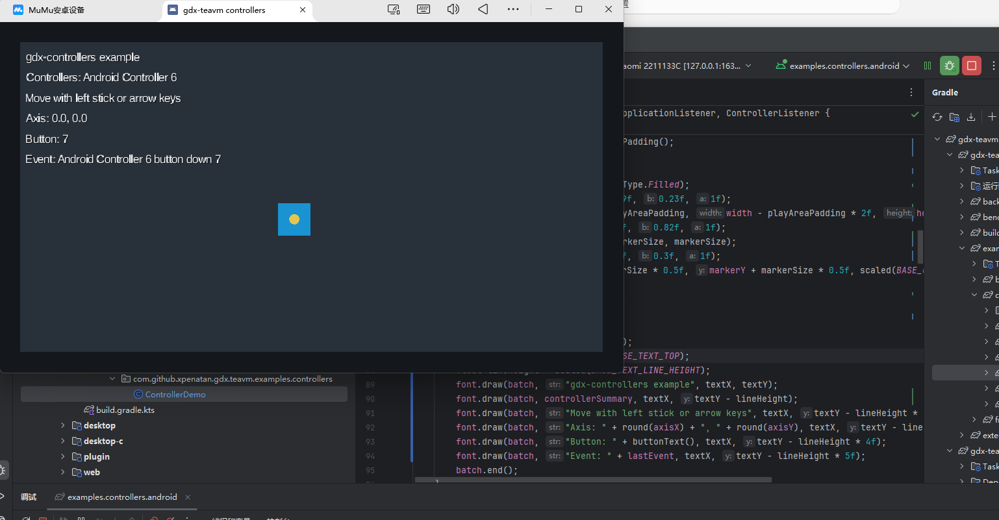

# Android Controller Verification

This module has been verified to run on Android with controller support enabled.

## Verification Result

- Emulator: MuMu Android device
- ADB target: `127.0.0.1:16384`
- App module: `:examples:controllers:android`
- Result: controller detected and button input received by the demo

## Why MuMu Was Used

This verification was performed with a third-party emulator that is known to expose controller input to the Android guest.

The default Android Studio emulator may not reliably expose gamepad functionality in every host setup, so MuMu was used here as a practical verification environment for Android controller support.

The screenshot below shows the Android controller example running successfully and receiving a button event:



## What Was Confirmed

- The Android example launches successfully.
- The controller is listed in the demo UI.
- Button input reaches the libGDX controller layer.
- The demo event text updates when a controller button is pressed.

## Proof In Screenshot

- `Controllers: Android Controller 6`
- `Button: 7`
- `Event: Android Controller 6 button down 7`

## Typical Run Flow

Build and install:

```bat
gradlew.bat :examples:controllers:android:installDebug
```

Launch:

```bat
adb -s 127.0.0.1:16384 shell am start -n com.github.xpenatan.gdx.teavm.examples.controllers.android/com.github.xpenatan.gdx.teavm.examples.controllers.android.MainActivity
```
